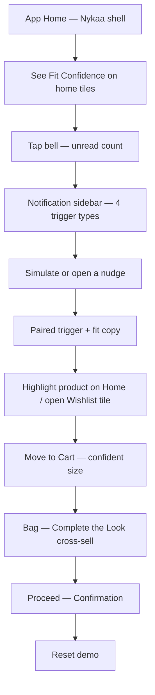
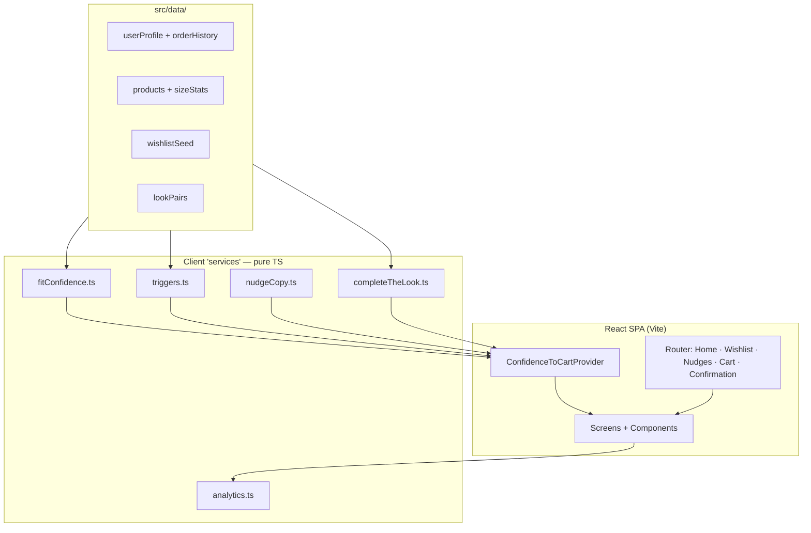
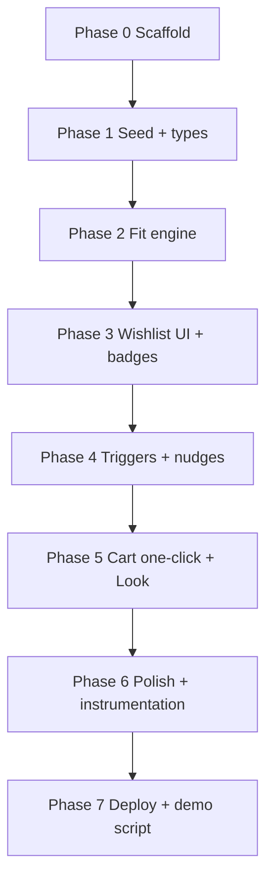
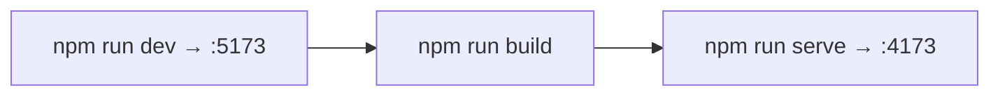

# Confidence-to-Cart — Architecture & Implementation Plan

> **Plan only.** Do not treat this file as permission to implement. Product scope, KPI, layers, constraints, and success criteria are defined only in **[problemStatement.md](./problemStatement.md)**. If the two conflict, amend the problem statement first.

**Delivery form:** a **React UI MVP** — clickable, mobile-first, publicly deployable prototype. No real backend, payments, push infra, or ML training. Fit scores, triggers, and recommendations are computed in the browser from seeded mock data so a tester can walk the full three-layer loop on a shareable link.

**Prior MVP (reference mechanics only):** `NL_MVPBlinkIT` — React Context + mock seed + Vercel. Do **not** copy Blinkit dark/green UI or Explorer XP. This product is Nykaa Fashion wishlist conversion.

---

## Table of contents

1. [Executive summary](#1-executive-summary)
2. [Requirements → plan map](#2-requirements--plan-map)
3. [End-to-end user flow](#3-end-to-end-user-flow)
4. [Architecture principles](#4-architecture-principles)
5. [System architecture](#5-system-architecture)
6. [Tech stack](#6-tech-stack)
7. [Data model (mock)](#7-data-model-mock)
8. [Fit confidence engine (client)](#8-fit-confidence-engine-client)
9. [Trigger detection & nudge dispatch (client)](#9-trigger-detection--nudge-dispatch-client)
10. [One-click cart & Complete the Look](#10-one-click-cart--complete-the-look)
11. [Shared app state](#11-shared-app-state)
12. [Screen & route architecture](#12-screen--route-architecture)
13. [Component architecture](#13-component-architecture)
14. [Visual design system (Nykaa)](#14-visual-design-system-nykaa)
15. [Instrumentation (demo logging)](#15-instrumentation-demo-logging)
16. [Repository layout](#16-repository-layout)
17. [Phase-wise implementation plan](#17-phase-wise-implementation-plan)
18. [Demo script for graders](#18-demo-script-for-graders)
19. [Deployment](#19-deployment)
20. [Risks & mitigations](#20-risks--mitigations)
21. [Testing strategy](#21-testing-strategy)
22. [Definition of done](#22-definition-of-done)
23. [Out of scope / future production](#23-out-of-scope--future-production)
24. [UX revision — Nykaa app home (canonical demo)](#24-ux-revision--nykaa-app-home-canonical-demo)

---

## 1. Executive summary

**Confidence-to-Cart** is a single connected loop of three UI layers, shown inside a **Nykaa mobile-app shell** (not a desktop website clone, not a PM dashboard):

| Layer | Failure it fixes | MVP manifestation (target UX) |
|---|---|---|
| **1 — Fit Confidence Badge** | Unresolved doubt | **Prominent on Home** product / “Saved for you” tiles (and Wishlist); personal → crowd → “not enough data” |
| **2 — Trigger nudges** | Passive forgetting | **In-app notifications** via header **bell → side panel** (all 4 triggers). **No separate Nudges tab/page** as the story |
| **3 — One-click + cross-sell** | Re-engagement friction | Move to Cart in confident size → **Complete the Look** at the add-to-bag moment |

| Dimension | Decision |
|---|---|
| **Product** | Nykaa Fashion (`com.fsn.nds` / `1439872423`) |
| **KPI informed** | ↑ % users who buy ≥1 wishlisted item within 30 days of save |
| **Hard constraint** | No coupons, discounts, cashback, price-cuts, or flash-sale framing (even if live Nykaa screenshots show % off) |
| **Audience for demo** | Graders / PMs on **localhost** (Vercel later if asked) |
| **Form** | React SPA (Vite), **mobile app frame** (~390px), Nykaa visual language |
| **Visual refs** | [`docs/references/nykaa-home-desktop.png`](./docs/references/nykaa-home-desktop.png), [`docs/references/nykaa-plp-desktop.png`](./docs/references/nykaa-plp-desktop.png) — **adapt to app**, do not ship desktop chrome |
| **State** | One `ConfidenceToCartContext` — in-memory |
| **Data** | Seeded mock: user order/return history, product size stats, wishlist, triggers, look pairs |
| **Deploy (now)** | Localhost (`npm run dev` / `npm run serve`) |

### What a tester must be able to do (maps to problem statement §7)

1. Open **Home (app)** and see **Fit Confidence badges on home tiles** without tap-through.
2. Tap **bell** → **notification sidebar**; simulate/open ≥1 of the **4** trigger types; read **paired** confidence + trigger copy.
3. One-click **Move to Cart** (Home or Wishlist) in the **confident size**.
4. See **Complete the Look** at the add-to-bag moment (≥1 complement).
5. Complete the loop on localhost using DEMO.md without the builder driving clicks.
6. **Reset demo** to replay.

---

## 2. Requirements → plan map

| Problem-statement requirement | Plan owner |
|---|---|
| Personal keep-vs-return fit model | §8 + Phase 2 seed + `computeFitConfidence()` |
| Crowd per-product/size keep rate fallback | §8 |
| Data-sufficiency → “not enough data yet” | §8 thresholds |
| Badge on wishlist tile (no tap-through) | §12–13, Phase 3; **Home prominence → Phase 8** |
| Four trigger types evaluated | §9, Phase 4 |
| Nudge only on qualifying trigger; paired copy | §9, Phase 4; **bell → sidebar → Phase 8** |
| One-click add-to-cart + confident size | §10, Phase 5 |
| Complete the Look (1–2 items) | §10, Phase 5; **at add-to-bag moment → Phase 8** |
| Instrumentation for later metrics | §15, Phase 6 |
| No monetary incentives | §4, §14 copy lint |
| Localhost deliverable | §19, Phase 7 |
| Nykaa **app** home (not desktop web) | **§24, Phase 8** |
| Slice: 1–2 apparel categories | §7 mock corpus |

---

## 3. End-to-end user flow

> **Canonical grader path** (target after Phase 8). Home is the stage; notifications are a sidebar, not a tab.



### Step-by-step (happy path)

| Step | Surface | What happens |
|---|---|---|
| 1 | **Home (app)** | Utility strip + NYKAA header + search + **bell** + bag; category chips; hero carousel; **Saved for you** / featured grid with **prominent Fit Confidence** |
| 2 | **Bell → sidebar** | Slide-over panel lists trigger notifications only; Demo simulate for all 4 types |
| 3 | **Nudge row** | Paired copy; tap → close sidebar + highlight target product on Home (or jump to Wishlist tile) |
| 4 | **Home / Wishlist tile** | Badge still visible without tap-through; optional expand for detail |
| 5 | **Move to Cart** | Confident size pre-filled; insufficient → size sheet only |
| 6 | **Bag** | Line + **Complete the Look** (1–2) at the add moment |
| 7 | **Confirmation** | Fit notes checked — never sale/coupon |
| 8 | **Reset** | Seed restored |

### UX contracts

- **App frame, not website:** no left filter column, no multi-column desktop nav, no “Sign in” as the hero of chrome.
- **No Nudges bottom-nav tab** in the target story — bell + sidebar only.
- Fit Confidence is **on-tile and readable** on Home (not a tiny corner chip only).
- Nudges are **not** generic daily reminders — only the four triggers.
- Live Nykaa % Off / “Extra 20% on App” patterns from screenshots are **reference only** — banned in product copy.
- Badge text is visible **on the tile**; expand/detail is optional, not required to “see” confidence.
- Move to Cart **does not** require a full PDP first.
- Size on cart line = `confidentSize` from Layer 1 (or size sheet only when `insufficient`).
- Dismiss nudge does not block Home / Wishlist / Cart.

---

## 4. Architecture principles

1. **UI prototype-first** — React only; all “services” are pure TS modules over mock JSON.
2. **Three layers, one loop** — every demo path should touch badge → nudge → one-click (+ look).
3. **Nykaa app shell** — mobile frame first; Home looks like Nykaa **app**, not a desktop PLP/website.
4. **Single source of truth** — one context drives Home, sidebar, Wishlist, Cart, Confirmation, event log.
5. **Honest confidence** — never invent fit; prefer “not enough data yet” over fake certainty.
6. **Simulate real systems** — trigger engine + notification sidebar stand in for push; document production swap.
7. **Resettable** — graders can replay without clearing browser storage (or clear on Reset).
8. **Incentive banlist** — lint UI copy; reject sale framing even when mirroring live Nykaa comps.

---

## 5. System architecture



**No backend host.** No Render, no FastAPI, no real push notifications. “Notification dispatch” = in-app Nudge tray + toast + optional browser `Notification` only if permission granted (optional; not required for DoD).

---

## 6. Tech stack

| Layer | Choice | Notes |
|---|---|---|
| UI framework | **React 18+** | Functional components only |
| Bundler | **Vite** | SPA; matches Nykaa discovery frontend family |
| Language | **TypeScript** | Strict types for fit/trigger unions |
| Routing | **React Router** | `/`, `/wishlist`, `/nudges`, `/cart`, `/confirmation` |
| Styling | **Tailwind CSS** | Brand tokens as CSS variables |
| Icons | **Lucide React** | |
| State | **React Context + useReducer** | No Redux |
| Data | **Static TS/JSON seed** | |
| Deploy | **Vercel** | Static build output |
| Tests | Manual + optional Playwright happy path | Phase 7 |

**Explicitly not chosen for this MVP:** Next.js, Streamlit, Vue, native apps, Node API, database, Groq/LLM in the browser.

---

## 7. Data model (mock)

Seed a **slice**: tops + dresses (and optionally one footwear) under 2–3 mock brands — enough for personal vs crowd vs insufficient paths.

### 7.1 Core types (contract)

```ts
type Category = "tops" | "dresses" | "footwear";
type Size = "XS" | "S" | "M" | "L" | "XL";

type FitSource = "personal" | "crowd" | "insufficient";

type TriggerType =
  | "price_stable"
  | "back_in_stock"
  | "low_stock"
  | "occasion";

interface OrderHistoryItem {
  productId: string;
  brand: string;
  category: Category;
  size: Size;
  outcome: "kept" | "returned_fit"; // only fit-relevant returns count
}

interface ProductSizeStat {
  productId: string;
  size: Size;
  keptCount: number;
  returnedFitCount: number;
}

interface Product {
  id: string;
  name: string;
  brand: string;
  category: Category;
  imageUrl: string;
  priceInr: number;           // display only — no strike/sale CTA
  priceStableDays: number;    // for price_stable trigger
  stockBySize: Record<Size, number>;
  occasionTag?: string;       // e.g. "Wedding · Sep"
  lookPairIds: string[];      // 1–2 complementary product ids
}

interface WishlistEntry {
  productId: string;
  savedAtLabel: string;       // "Saved 18 days ago"
  occasionTag?: string;
}

interface FitBadge {
  source: FitSource;
  confidentSize: Size | null;
  shortLabel: string;         // tile-visible
  detail: string;             // optional expand
  keepRate?: number;          // crowd path
}

interface Nudge {
  id: string;
  productId: string;
  trigger: TriggerType;
  title: string;
  body: string;               // MUST pair trigger + confidence
  createdAt: string;
  dismissed: boolean;
  read: boolean;
}
```

### 7.2 Seed scenarios (must ship all three badge paths)

| Wishlist item | Intended badge path | Why |
|---|---|---|
| Brand A dress | **personal** | User returned M dresses from Brand A, keeps M in tops → suggest L |
| Brand B top | **crowd** | No personal brand/category history; size stats show high keep rate for M |
| New / sparse SKU | **insufficient** | Below thresholds → “Not enough data yet” |
| 1–2 others | mix | Variety for triggers (stock 0→N, low stock, occasion, price stable) |

### 7.3 User profile seed

- Display name (demo persona)
- `orderHistory[]` with enough kept/returned_fit rows for Brand A
- No real PII

---

## 8. Fit confidence engine (client)

**Module:** `src/lib/fitConfidence.ts`  
**Input:** `user.orderHistory`, `product`, `productSizeStats`  
**Output:** `FitBadge`

### 8.1 Personal path

1. Filter history to same `brand` + `category` as the wishlisted product.
2. If `kept` and `returned_fit` counts for that slice are below **personalMinEvents** (plan default: **3**), personal path fails → try crowd.
3. Derive `confidentSize`:
   - Prefer size with highest keep rate in that brand/category.
   - If user returned size M for this brand/category but keeps adjacent sizes elsewhere, recommend the adjacent size commonly kept (seed rule table is fine for MVP — e.g. “returned M dresses → suggest L”).
4. `shortLabel` examples:
   - `"Fits your profile · L"`
   - `"You keep M in tops; L in this brand’s dresses"`

### 8.2 Crowd fallback

1. For each size with stats, `keepRate = kept / (kept + returnedFit)`.
2. Require **crowdMinSamples** (plan default: **20**) on the chosen size.
3. Pick size with best keepRate among sufficient samples (or seed’s “recommended” size).
4. `shortLabel` example: `"68% kept size M — no return for fit"`

### 8.3 Insufficient

If both paths fail:

- `source: "insufficient"`
- `confidentSize: null`
- `shortLabel: "Not enough data yet"`
- `detail` explains need for more keep/return signal
- **UI:** Move to Cart either disabled with helper (“Pick a size when data arrives”) **or** opens a minimal size picker — prefer **size picker only on insufficient**, to keep one-click pure on personal/crowd.

### 8.4 Production comment

Comment in module: replace with service reading order/return warehouse + product size aggregates; thresholds tunable via config.

---

## 9. Trigger detection & nudge dispatch (client)

**Modules:** `src/lib/triggers.ts`, `src/lib/nudgeCopy.ts`

### 9.1 Evaluation rules (mock)

| Trigger | Qualifying condition (seed fields) |
|---|---|
| `price_stable` | `priceStableDays >= 14` (configurable) |
| `back_in_stock` | Confident size stock was 0 in seed “before” flag, now `stockBySize[confidentSize] > 0` |
| `low_stock` | `0 < stockBySize[confidentSize] <= 3` |
| `occasion` | `occasionTag` present and `occasionSoon === true` on seed |

Skip trigger if badge is `insufficient` **for size-specific triggers** (`back_in_stock`, `low_stock`) — or fire with generic stock copy only if size known; **prefer skip** to avoid misleading “your size.”

### 9.2 Dispatch (MVP stand-in)

- On app load: run `evaluateTriggers(wishlist, products, badges)` → enqueue unseen nudges.
- **Simulate panel:** buttons that force-fire each trigger type for a chosen item (sets seed flags then re-evaluates).
- Nudge appears in `/nudges` + optional toast on Home/Wishlist.
- No real APNs/FCM.

### 9.3 Paired copy contract

Every nudge `body` must include:

1. Trigger fact (“Back in stock in size L”)
2. Confidence fragment (“buyers with your fit profile rarely return this” / crowd keep rate)

Ban: “extra off,” “sale,” “coupon,” “hurry limited deal” as discount framing. Low-stock may say scarcity in **their size** only when true in seed.

---

## 10. One-click cart & Complete the Look

### 10.1 Move to Cart

- From Wishlist tile CTA.
- Payload: `{ productId, size: badge.confidentSize, source: "wishlist_one_click" }`.
- If `insufficient` → size sheet first, then add.
- Navigate to Cart (or stay + toast — **prefer navigate to Cart** so Complete the Look is obvious).

### 10.2 Complete the Look

- `completeTheLook(productId)` returns 1–2 products from `lookPairIds` not already in cart/wishlist conversion.
- Render horizontal row under the converted line on Cart (and optionally Confirmation).
- Secondary “Add” uses same cart reducer; no discount upsell language (“pairs well,” “finishes the look”).

---

## 11. Shared app state

```ts
interface AppState {
  user: UserProfile;
  products: Product[];
  sizeStats: ProductSizeStat[];
  wishlist: WishlistEntry[];
  badgesByProductId: Record<string, FitBadge>;
  nudges: Nudge[];
  cart: CartLine[];           // { productId, size, fromWishlist: boolean }
  lastTriggerSimulated: TriggerType | null;
  eventLog: AnalyticsEvent[];
  nudgeInboxOpenHint: boolean;
}
```

**Actions (reducer):**  
`HYDRATE_FROM_SEED` · `RECOMPUTE_BADGES` · `EVALUATE_TRIGGERS` · `SIMULATE_TRIGGER` · `DISMISS_NUDGE` · `MARK_NUDGE_READ` · `ADD_TO_CART` · `ADD_LOOK_ITEM` · `CLEAR_CART` · `CONFIRM` · `RESET_DEMO` · `LOG_EVENT`

Badges recompute whenever seed/user history changes (normally once on hydrate + after reset).

---

## 12. Screen & route architecture

| Route | Purpose (target after Phase 8) |
|---|---|
| `/` | **Nykaa app Home** — chrome, hero, category chips, Saved for you + featured grid with Fit Confidence; bell opens sidebar |
| `/wishlist` | Full wishlist grid (same badges + Move to Cart) |
| `/cart` | Bag lines + Complete the Look + Proceed |
| `/confirmation` | Success without monetary incentives |
| — | **`/nudges` route removed from story** — notifications live in sidebar overlay (route may redirect to Home + open panel) |

### Layout chrome (app)

- Thin utility strip (non-sale: e.g. “Fit confidence on saved styles — no codes needed”)
- App header: **NYKAA** · search field · **bell (badge count)** · bag
- Horizontal **category chips** (Fashion-focused: Ethnic, Western, Footwear, Accessories, …)
- Bottom nav: **Home · Categories · Wishlist · Bag** (no Nudges tab)
- **NotificationSidebar** — slide from right over dimmed Home when bell tapped

### Home first viewport (app composition)

1. Utility strip  
2. Header (wordmark + search + bell + bag)  
3. Category chip row  
4. **One hero carousel** (edge-to-edge in the phone frame; fashion atmosphere — **no % off** copy)  
5. Below fold: **Saved for you** horizontal/vertical tiles with **prominent Fit Confidence**  

No desktop left filter rail. No multi-link desktop mega-nav.

---

## 13. Component architecture

```
src/
  components/
    layout/     AppShell, UtilityBar, AppHeader, CategoryChips, BottomNav, NotificationSidebar
    home/       HeroCarousel, SavedForYouRail, HomeProductCard, DemoResetButton, EventLogViewer
    wishlist/   WishlistGrid, WishlistTile, FitConfidenceBadge, MoveToCartButton
    nudges/     NudgeList, NudgeCard, SimulateTriggerPanel  # rendered inside NotificationSidebar
    cart/       CartLineItem, CompleteTheLookRow, ProceedButton
    confirm/    ConfirmationPanel
    ui/         Button, Chip, Toast, SizePickerSheet
  ...
```

**FitConfidenceBadge:** always visible on Home product cards **and** Wishlist tiles; variants `personal` | `crowd` | `insufficient`. On Home, badge is **primary secondary signal** under title/price — larger than a FEATURED corner tag.

**NotificationSidebar:** contains nudge list + demo simulate; closes on backdrop / row action / X.

---

## 14. Visual design system (Nykaa)

| Token | Value | Use |
|---|---|---|
| Pink | `#FC2779` | Wordmark, primary CTAs, active nav, OFFERS-style accents (non-sale use) |
| Pink hover | `#E01B68` | |
| Utility bar | `#FFC4A8` → `#FC2779` | Top strip |
| Canvas | `#F7F7F7` / white | App bg |
| Surface | `#FFFFFF` | Header, tiles, sidebar |
| Ink | `#001325` | Titles |
| Muted | `#6F6F6F` | Meta, insufficient badge |
| Hairline | `#E8E8E8` | Borders |
| Search fill | `#F3F3F3` | Search field |
| Radius | 8–12px | Tiles/panels; pill CTAs where Nykaa uses them |

**Phone frame:** max-width ~390–430px centered (already `#root` capped); feels like an installed app, not a responsive desktop site.

**From reference screenshots (adapt, don’t clone desktop):**
- Wordmark weight/color, search pill, product card density, FEATURED-style labels  
- **Do not** port left filter sidebar, desktop Categories/Brands mega-nav, or discount/% off hero copy  

**Copy lint helper:** `assertNoIncentiveCopy(str)` flags coupon|discount|cashback|% off|flash sale.

---

## 15. Instrumentation (demo logging)

Append-only `eventLog` in context (also `console.info` in dev):

| Event | Payload |
|---|---|
| `badge_impressed` | productId, source, confidentSize |
| `nudge_shown` | nudgeId, trigger, productId |
| `nudge_dismissed` | nudgeId |
| `simulate_trigger` | trigger, productId |
| `move_to_cart` | productId, size, source |
| `look_add` | parentId, lookProductId |
| `confirm` | cartProductIds |

Optional simple `/` or Wishlist footer: “Demo events: N” for graders — not a metrics dashboard.

---

## 16. Repository layout

```
NYKAA_MVP/
├── problemStatement.md
├── architecture.md              # this plan
├── README.md                    # when build starts: setup + live URL
├── package.json
├── index.html
├── vite.config.ts
├── tailwind.config.js
├── tsconfig.json
├── public/                      # images / favicon
├── src/
│   ├── main.tsx
│   ├── App.tsx
│   ├── index.css
│   ├── components/...
│   ├── context/...
│   ├── data/...
│   ├── lib/...
│   ├── types/...
│   └── routes/...
├── e2e/                         # optional Playwright
└── .gitignore
```

---

## 17. Phase-wise implementation plan



### Phase 0 — Scaffold (React + Vite)

**Goal:** Empty app boots with Nykaa chrome.

| Task | Output |
|---|---|
| 0.1 | Vite + React + TS + Tailwind + React Router |
| 0.2 | CSS variables from §14; Header wordmark |
| 0.3 | Route stubs for all five screens |
| 0.4 | BottomNav + AppShell |
| 0.5 | `.gitignore`, README stub (scripts only) |

**Exit:** Navigate all routes; brand visible; no business logic yet.

---

### Phase 1 — Types & seed corpus

**Goal:** Data that can exercise all badge paths and all four triggers.

| Task | Output |
|---|---|
| 1.1 | `types/` per §7 |
| 1.2 | User + orderHistory (personal path possible) |
| 1.3 | 5–6 products (tops/dresses), size stats, stock maps |
| 1.4 | Wishlist seed (aged saves + occasion tags) |
| 1.5 | Look pairs (1–2 per hero SKU) |
| 1.6 | Provider hydrates seed; Reset restores |

**Exit:** Context holds seed; Reset works; still no badges UI.

---

### Phase 2 — Fit confidence engine

**Goal:** Deterministic `FitBadge` for every wishlist product.

| Task | Output |
|---|---|
| 2.1 | `computeFitConfidence` personal → crowd → insufficient |
| 2.2 | Threshold constants documented |
| 2.3 | Unit-style tests or assert table for the three seed scenarios |
| 2.4 | `RECOMPUTE_BADGES` on hydrate |

**Exit:** Logging/console or temporary debug panel shows three distinct sources.

---

### Phase 3 — Wishlist UI + Layer 1 badges

**Goal:** Problem statement success criterion #1.

| Task | Output |
|---|---|
| 3.1 | WishlistGrid + WishlistTile |
| 3.2 | FitConfidenceBadge on tile (always visible) |
| 3.3 | Optional expand for `detail` |
| 3.4 | Move to Cart button present (wire in Phase 5 if needed) |
| 3.5 | `badge_impressed` events |

**Exit:** Grader sees personal, crowd, and insufficient badges without tapping through.

---

### Phase 4 — Triggers + Layer 2 nudges

**Goal:** Success criterion #2.

| Task | Output |
|---|---|
| 4.1 | `evaluateTriggers` for all four types |
| 4.2 | `nudgeCopy` paired templates |
| 4.3 | Nudges inbox UI |
| 4.4 | SimulateTriggerPanel (demo-only styling) |
| 4.5 | Toast when new nudge enqueued |
| 4.6 | Dismiss / read actions |

**Exit:** Simulate each trigger once; message pairs trigger + confidence.

---

### Phase 5 — Layer 3 cart + Complete the Look

**Goal:** Success criteria #3 and #4.

| Task | Output |
|---|---|
| 5.1 | One-click add with `confidentSize` |
| 5.2 | SizePickerSheet only for insufficient |
| 5.3 | Cart page line items |
| 5.4 | CompleteTheLookRow (1–2) |
| 5.5 | Proceed → Confirmation |
| 5.6 | Copy audit: no incentive language |

**Exit:** Full loop from nudge → Move to Cart → look suggestion → confirm.

---

### Phase 6 — Polish & instrumentation

| Task | Output |
|---|---|
| 6.1 | Mobile layout QA (375px+) |
| 6.2 | Motion: subtle badge fade / toast / tile highlight on nudge target (2–3 intentional motions) |
| 6.3 | Event log viewer (minimal) |
| 6.4 | `copyLint` sweep |
| 6.5 | Empty/error states (empty cart, no nudges) |

**Exit:** Feels like Nykaa Fashion; demo is self-explanatory.

---

### Phase 7 — Deploy & handoff

| Task | Output |
|---|---|
| 7.1 | Local host scripts (`npm run dev` / `npm run serve`) + SPA-ready `vercel.json` kept for later |
| 7.2 | README documents **localhost** URL as current deliverable |
| 7.3 | DEMO.md grader script against localhost |
| 7.4 | Optional Playwright happy path |

**Exit:** Third party can complete §7 success criteria on a local URL (`127.0.0.1:5173` or `:4173`) using DEMO.md alone. Public Vercel deploy is deferred until requested.

---

### Phase 8 — Nykaa app-home UX revision (**plan locked; implement only when asked**)

**Goal:** Replace the current PM-style Home / separate Nudges tab with a **Nykaa mobile-app Home** + **notification sidebar**, per §24.

| Task | Output |
|---|---|
| 8.1 | AppHeader (search + bell + bag); remove Nudges from bottom nav |
| 8.2 | CategoryChips + HeroCarousel (no % off copy) |
| 8.3 | Saved for you / HomeProductCard with **prominent** FitConfidenceBadge + Move to Cart |
| 8.4 | NotificationSidebar (slide-over) hosting NudgeList + SimulateTriggerPanel |
| 8.5 | Bell unread badge; row tap → highlight product on Home |
| 8.6 | Keep Wishlist / Cart / Confirmation; redirect `/nudges` → Home + open sidebar |
| 8.7 | Update DEMO.md + Playwright selectors for new chrome |
| 8.8 | Copy lint pass on all new Home/sidebar strings |

**Exit:** Graders complete §18 script entirely from **app Home + bell sidebar** without needing a Nudges page.

---

## 18. Demo script for graders

1. Open **http://127.0.0.1:5173/** → **Nykaa app Home**.
2. Point out **Fit Confidence** on home tiles (personal / crowd / not enough data).
3. Tap **bell** → sidebar → **Simulate** “Back in stock” (or Occasion) → read paired copy.
4. Tap the nudge (or follow highlight) → **Move to Cart** in confident size.
5. On **Cart**, show **Complete the Look** → optionally add one.
6. **Proceed** → Confirmation (no discount language).
7. **Reset demo** → repeat if needed.

---

## 19. Deployment



| Item | Choice |
|---|---|
| Host (now) | **Localhost** — Vite dev or `vite preview` |
| Host (later) | Vercel when explicitly requested (`vercel.json` ready) |
| Backend | None |
| Env vars | None required for V1 |
| SPA | Client-side React Router; Vite preview serves `index.html` for app routes |

---

## 20. Risks & mitigations

| Risk | Mitigation |
|---|---|
| Graders think nudges need real push | Label Simulate panel; document in-app inbox as MVP stand-in |
| Misleading fit claims | Hard insufficient path + thresholds |
| Looks like discount app | Copy lint; utility bar messaging |
| Scope creep (real ML, PDP, checkout) | Freeze at mock confirm |
| Weak Nykaa fidelity | Lock tokens §14; Phase 8 app-home vs desktop refs |
| Looks like desktop website | Phone frame + bottom nav; no filter rail (§24.2) |
| Separate Nudges tab confuses story | Bell → sidebar only (§24.5) |
| Compare to Blinkit MVP confusion | No XP/milestones; Nykaa pink app shell |

---

## 21. Testing strategy

| Layer | What |
|---|---|
| Manual | §18 script on mobile width |
| Logic | Table tests: 3 badge scenarios; 4 triggers fire/skip |
| E2E optional | Playwright: wishlist badges → simulate nudge → move to cart → look → confirm → reset |
| Copy | Grep banlist before deploy |

---

## 22. Definition of done

1. React + Vite SPA runnable on **localhost** (`npm run dev` / `npm run serve`).
2. **Nykaa app Home** shows Fit Confidence on home tiles (personal, crowd, insufficient).
3. **Bell → sidebar** exposes all 4 trigger types (simulate + paired copy); no Nudges tab required.
4. One-click Move to Cart uses confident size (or picker only when insufficient).
5. Complete the Look shows ≥1 complementary item at add-to-bag / Cart.
6. Reset demo restores seed.
7. No monetary incentive language in UI (including hero/carousel).
8. README + DEMO.md document the localhost grader path.
9. Third party can complete the loop from Home without the builder.

---

## 23. Out of scope / future production

**Not in this MVP**

- Real order/return warehouse or size-stat pipelines
- Real push/email/SMS
- Payments, login, inventory systems
- LLM-generated copy
- Exhaustive category coverage
- A/B experiment platform
- Pixel-perfect clone of desktop Nykaa.com (app adaptation only)
- Shipping Vercel until explicitly requested

**Later (production sketch only)**

- Batch job: recompute badges + evaluate triggers
- Push with deep link → saved item / Home highlight
- Fit model trained on keep/return with brand–category embeddings
- Wire discovery themes from `NAYKAA_AiDiscovery` into badge explanations
- Part 6 metrics from real `badge_impressed` / `nudge_shown` / `move_to_cart` events

---

## 24. UX revision — Nykaa app home (canonical demo)

> **Status:** Plan only. **Do not implement until explicitly asked.**  
> Visual sources: [`docs/references/nykaa-home-desktop.png`](./docs/references/nykaa-home-desktop.png), [`docs/references/nykaa-plp-desktop.png`](./docs/references/nykaa-plp-desktop.png).

### 24.1 Problem with the current prototype UI

Phases 0–7 proved the three-layer **logic**. The present Home is still a **PM landing** (headline + CTAs + stats), and nudges live on a **separate tab**. Graders should feel they opened the **Nykaa Fashion app**, then discovered Confidence-to-Cart inside it.

### 24.2 App vs website (hard rules)

| Do (app) | Don’t (desktop web) |
|---|---|
| Single-column phone frame (~390px) | Left filter sidebar / Sort By Popularity rail |
| Header: logo + search + bell + bag | Categories / Brands / Luxe / Beauty Advice mega-nav |
| Horizontal category **chips** | Full desktop secondary nav row as primary IA |
| Edge-to-edge hero **carousel** (1 card visible) | 3-up desktop promo strip |
| 2-col product grid or horizontal rails | Wide 3–4 col PLP |
| Bottom tab bar | Floating web chat widget as primary chrome |
| Bell → **side panel** notifications | Dedicated `/nudges` page as the story |

### 24.3 Home information architecture (top → bottom)

```text
┌─────────────────────────────────────┐
│ utility strip (non-sale)            │
├─────────────────────────────────────┤
│ NYKAA   [ Search on Nykaa ]  🔔  👜 │
├─────────────────────────────────────┤
│ Ethnic · Western · Footwear · …  →  │  category chips
├─────────────────────────────────────┤
│ ░░░░░░░░░ HERO CAROUSEL ░░░░░░░░░  │  fashion mood; NO % off
├─────────────────────────────────────┤
│ Saved for you                       │
│ ┌────┐ ┌────┐ ┌────┐                │
│ │img │ │img │ │img │  →             │
│ │FIT │ │FIT │ │FIT │                │  Fit Confidence PROMINENT
│ │Add │ │Add │ │Add │                │  Move to Cart on card
│ └────┘ └────┘ └────┘                │
├─────────────────────────────────────┤
│ Featured for you (2-col grid)       │
│ same badge treatment on saved SKUs  │
├─────────────────────────────────────┤
│ Reset demo (subtle)                 │
└─────────────────────────────────────┘
     Home · Categories · Wishlist · Bag
```

### 24.4 Fit Confidence on Home (Layer 1)

- Show on every **Saved for you** card and on featured cards that are in the wishlist seed.
- Placement: full-width bar under title/price (not only a tiny corner “FEATURED” clone).
- Must show **personal / crowd / insufficient** examples without leaving Home.
- Expand chevron optional; shortLabel always visible.

### 24.5 Notification sidebar (Layer 2) — replaces Nudges page

```text
        Home (dimmed)
                         ┌──────────────────┐
                         │ Notifications  ✕ │
                         │ Unread · Demo    │
                         ├──────────────────┤
                         │ [Price stable]   │
                         │ paired fit copy  │
                         ├──────────────────┤
                         │ [Back in stock]  │
                         ├──────────────────┤
                         │ [Low stock]      │
                         ├──────────────────┤
                         │ [Occasion]       │
                         ├──────────────────┤
                         │ Demo · Simulate  │
                         │ 4 trigger btns   │
                         └──────────────────┘
```

- Open: tap bell. Close: X, backdrop, or after choosing a nudge.
- Row tap: mark read → close → scroll/highlight product on Home.
- Simulate remains **Demo-labeled** inside the panel.
- Bottom nav **drops Nudges**; `/nudges` redirects to `/?notify=1` (open sidebar).

### 24.6 Complete the Look (Layer 3) — at add-to-bag

- Trigger when user Moves to Cart from Home or Wishlist.
- Show on Cart immediately under the converted line (existing Phase 5 behavior; keep).
- Optional: brief toast “Complete the look ready in bag”.

### 24.7 Copy / brand constraints from screenshots

| From live Nykaa comps | In our MVP |
|---|---|
| “Up To 35% Off”, “Extra 20% off On App” | **Forbidden** |
| FEATURED / BESTSELLER tags | Allowed as merchandising labels (non-price) |
| Pink wordmark, search fill, white cards | **Required** |
| Peach→pink promo energy | Utility strip OK if message is confidence/fit, not sale |

### 24.8 Implementation order (when approved)

1. AppHeader + CategoryChips + BottomNav IA change  
2. HeroCarousel (static slides, no discount)  
3. SavedForYouRail + HomeProductCard + FitConfidenceBadge  
4. NotificationSidebar + wire bell / simulate / highlight  
5. Deprecate Nudges route from nav; update DEMO + e2e  
6. Visual QA vs references at 375 / 390 / 430  

### 24.9 Explicit non-goals for Phase 8

- Rebuilding real Nykaa catalog / login / filters  
- Beauty PLP (M.A.C screenshot is **style** reference; MVP stays Fashion wishlist slice)  
- Real push notifications  
- Vercel production deploy  

---

## Implementation order (when build is requested)

Phases **0–7** (logic + localhost) are in place.  
**Next build:** Phase **8** only — after explicit approval. Prefer vertical slices that keep the three-layer loop demoable from **app Home**.
